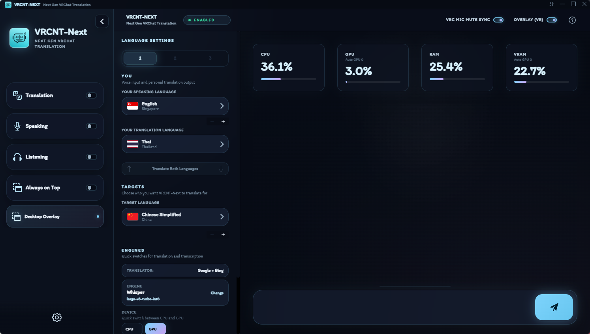
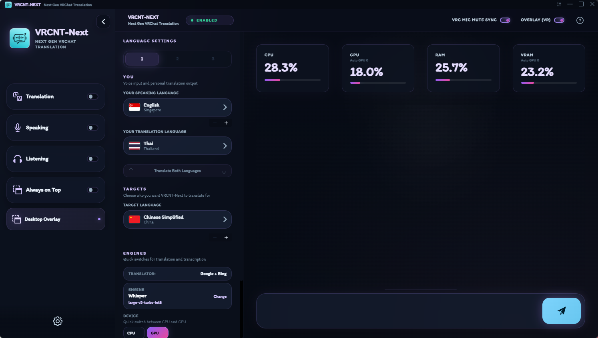
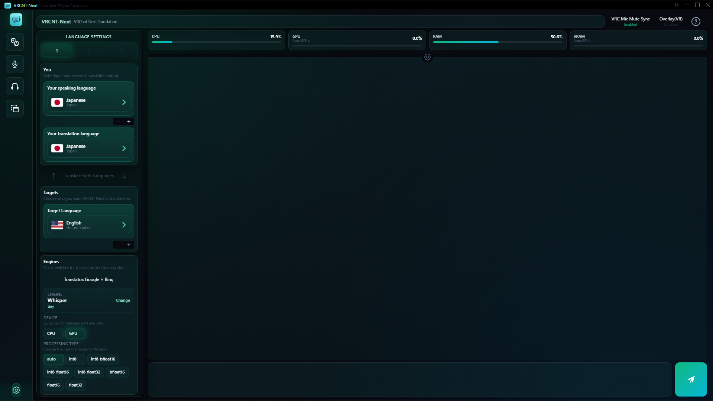

<p align="center">
  
</p>

<p align="center">
  <strong>A cleaner VRChat translation and transcription app, based on VRCT.</strong>
</p>

<p align="center">
  
  
  
</p>

## What is VRCNT-Next?

VRCNT-Next is an unofficial VRChat translation and transcription tool. It is built from the open-source [VRCT](https://github.com/misyaguziya/VRCT) codebase and shaped into a simpler, cleaner VRCNT-Next experience.

The goal is practical: make multilingual VRChat sessions easier with local AI models, readable language controls, VR overlay support, and a modern interface without extra features that do not belong in the app.

## Highlights

- Translate messages for VRChat chatbox workflows.
- Transcribe microphone and speaker audio.
- Use one Windows release package with CUDA support included.
- Fall back to CPU processing when a supported NVIDIA GPU is not available.
- Install signed in-app updates without deleting downloaded models.
- Show clearer country flags and language selectors.
- Display translation logs in a VR overlay.
- Keep the UI focused by removing the plugin system.

## Preview

<table align="center">
  <tr>
    <td align="center">
      <strong>Sakura Pink</strong><br />
      
    </td>
    <td align="center">
      <strong>Sakura Pink Performance</strong><br />
      
    </td>
  </tr>
  <tr>
    <td align="center">
      <strong>Neon Cyan</strong><br />
      
    </td>
    <td align="center">
      <strong>Neon Cyan Performance</strong><br />
      
    </td>
  </tr>
  <tr>
    <td align="center">
      <strong>Midnight Purple</strong><br />
      
    </td>
    <td align="center">
      <strong>Midnight Purple Performance</strong><br />
      
    </td>
  </tr>
  <tr>
    <td align="center">
      <strong>Emerald Green</strong><br />
      
    </td>
    <td align="center">
      <strong>Emerald Green Performance</strong><br />
      
    </td>
  </tr>
</table>

## Download

This repository is prepared for a single VRCNT-Next Windows release package:

- Portable package: `VRCNT-Next.zip`
- Windows installer: `VRCNT-Next_3.0.0_x64-setup.exe`

VRCNT-Next ships CUDA support in the main package. Users without a supported NVIDIA GPU can still run the app with CPU processing from the same download.

Downloaded models are stored in `%LOCALAPPDATA%\VRCNT-NextData\weights` so app updates and reinstalls do not remove them.

For development builds, the generated app is written to:

```text
src-tauri/target/release/VRCNT-Next.exe
```

## Build

Install dependencies first:

```powershell
npm install
```

Build the release version:

```powershell
npm run build-cuda
```

Create the portable release package:

```powershell
npm run release
```

## Project Lineage

VRCNT-Next is based on [VRCT](https://github.com/misyaguziya/VRCT) by misyaguziya.

The original VRCT project is MIT licensed. VRCNT-Next keeps the original copyright notice and license text, and adds VRCNT-Next attribution for the modified fork.

## Issues

Please report VRCNT-Next bugs in [awakenginexe/VRCNT-Next Issues](https://github.com/awakenginexe/VRCNT-Next/issues). Do not report VRCNT-Next-specific crashes to the upstream VRCT issue tracker.

## License

This project is released under the MIT License. See [LICENSE](LICENSE) and [NOTICE.md](NOTICE.md).

## Disclaimer

VRCNT-Next is unofficial software. It is not endorsed by VRChat and does not reflect the views or opinions of VRChat or anyone officially involved in producing or managing VRChat properties. VRChat and all associated properties are trademarks or registered trademarks of VRChat Inc.
